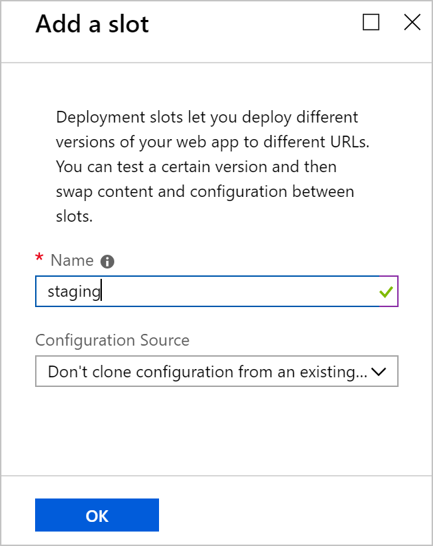
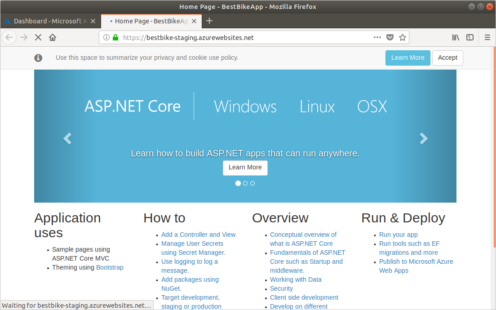
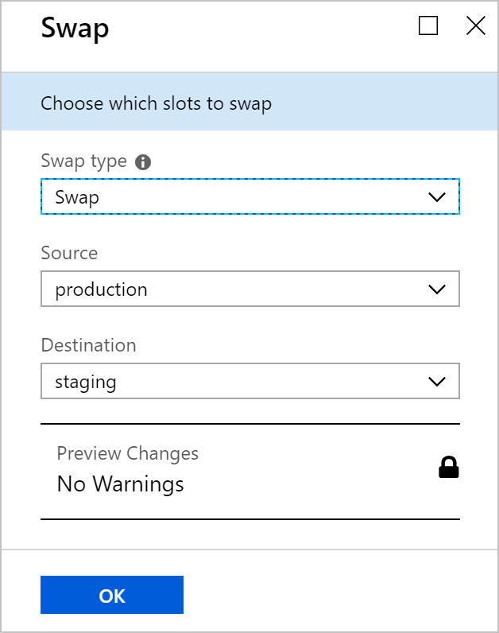
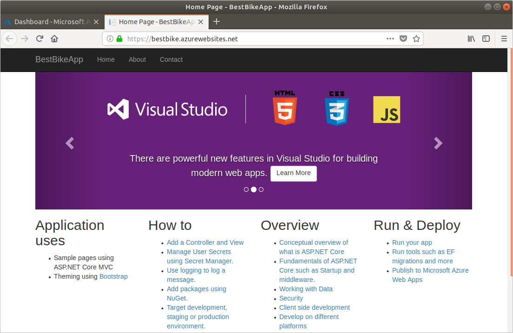
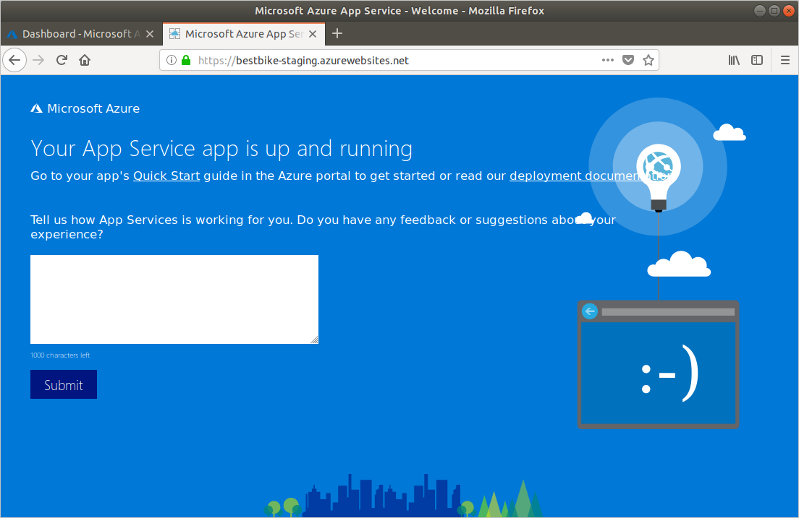

In this unit, you'll upload your ASP.NET Core application to Azure App Service.

## Create a staging deployment slot

1. Switch back to the [Azure portal](https://portal.azure.com/learn.docs.microsoft.com?azure-portal=true).

1. Open the App Service resource (the web app) you created previously. You can find it again by searching for the app in **All resources** or the containing resource group in **Resource groups**.

1. Click the newly created App Service with the **BestBike** name prefix. 

1. Click the **Deployment slots** menu item on the left-side navigation.

1. Inside the **Deployment slots** page, click the **Add Slot** button on the top navigation bar of the deployment slots page.

1. The Azure portal opens the **Add a slot** page as shown below.

    1. Give your deployment slot a name. In this case, use `staging`.

    2. To choose a **Configuration Source**, you have two options.

        * You can choose to clone the configuration elements from any existing deployment slot or App Service app.
        * Or you can choose not to clone any configuration elements. Select the option **Don't clone configuration from an existing slot**.

        For this deployment slot, choose the second option: **Don't clone configuration from an existing slot**. You will configure it directly.

    

1. Click the **OK** button at the bottom of the page to create your new deployment slot.

1. Once the deployment slot is successfully created, the Azure portal navigates you back to the **Deployment slots** page of your web app.

    Now, you can see the new deployment slot that you have just created.

    

1. Select the new deployment slot.

1. The Azure portal navigates to the **Overview** page of the newly created deployment slot.

    

    Notice the **URL** of the staging deployment slot. It is a different URL from what you saw previously, with the slot name appended.

    A deployment slot is treated as a full App Service app inside Azure. However, it is a special type that is a child of the original app and can be swapped with the original app.

    If you click the **URL**, you will see the same default page that Azure created for the deployment slot "app" the first time we created it in the Azure portal.

## Use a local Git repository as your deployment option

Next, we'll configure App Service for Git deployment. This will enable us to deploy new versions of our application by pushing our code to a Git endpoint in Azure.

1. Within the **staging** deployment slot "app", click the **Deployment Center** menu item on the left-hand navigation.

1. Click on **Local Git**.

1. Click **Continue**.

1. Click on **App Service Kudu build server**.

1. Click **Finish**.

## Create deployment credentials

Before you can deploy with Git, App Service requires you to set up a username/password that can be used to authenticate from the Git client.

1. Click the **Deployment Credentials** button.

1. Click on **User Credentials**.

1. If not already populated, set the **Username** field. This does not have to be the same as your Azure account username.

1. Enter a **Password** of your choice, and then confirm your password.

    > [!NOTE]
    > Make sure you don't forget your username and password! You will need them later when we start uploading and deploying our code to Azure.

1. Click on **Save Credentials**.

1. Take note of the **Git Clone Uri**, which is the Azure Git repository URL that you will use as a **remote** for your local application code repository.

## Set up Git on Cloud Shell

Git is already installed Azure Cloud Shell but you'll want to set your username and email for your cloud shell account.

1. In the Cloud Shell on the right, type the following commands, replacing the `[your name]` and `[your email]` placeholders with your own name and email (without the braces):

    ```bash
    git config --global user.name "[your name]"
    git config --global user.email "[your email]"
    ```

1. To verify that your information has been recorded by Git, type the following command:

    ```bash
    cat ~/.gitconfig
    ```

   You should be seeing the following, with your name and email shown:

    ```output
    [user]
        name = {your name}
        email = {your email}
    ```

## Initialize a local Git repository for your code

To start using Git, you need to initialize a local Git repository for your .NET Core application code.

1. Make sure you are in the project folder you created earlier.

    ```bash
    cd ~/BestBikeApp/
    ```

1. Initialize a new Git repository by issuing the following command:

    ```bash
    git init
    ```

    If the command is successful, you receive a message like the following:

    ```output
    Initialized empty Git repository in /home/{your-user}/BestBikeApp/.git/
    ```

1. Stage all the application files to Git.

   The next step is to let Git know about your application files. Do that by adding all the files of the working directory so that they get **staged** by Git. Type the following command:

    ```bash
    git add .
    ```

    The command above adds all files, represented by the ".", to the staging state of Git.

1. Now, you need to commit your changes to Git.

   Once you stage the files with Git, you need to commit your files to the **Git commit history** on your local machine. You do that by typing the following command:

    ```bash
   git commit -m "Initial commit"
    ```

   The `commit` command accepts the `-m` argument to include a message with the commit you are creating. Later on, when you push your code to Azure, you will be able to see the same message stored with this particular commit.

## Add a remote for the local Git repository

At this point, you have successfully initialized a new local Git repository. In addition, you've committed all of your application files to Git. What remains is to add a **remote** to connect your local Git repository to that hosted on Azure.

To do so, you need to:

1. Copy the **Git clone url** that you saw above.

1. Once copied, you go back to the **Terminal** window and issue the following Git command with your url:

    ```bash
    git remote add origin https://BESTBIKE-git@BESTBIKE-staging.scm.azurewebsites.net:443/BESTBIKE.git
    ```

    The above Git command connects your local Git repository to the one hosted on Azure. Now you can deploy your code by pushing to it.

1. To verify the above command, type the following Git command:

    ```bash
    git remote -v
    ```

    The command above generates the following output:

    ```output
    origin	https://BESTBIKE-git@BESTBIKE-staging.scm.azurewebsites.net:443/BESTBIKE.git (fetch)
    origin	https://BESTBIKE-git@BESTBIKE-staging.scm.azurewebsites.net:443/BESTBIKE.git (push)
    ```

## Push your code to Azure

Now that you have your local Git repository hooked to the remote Git repository on Azure, you will develop and build the app, and then push your application code to Azure.

1. Type the following Git command to push your **master** branch to the remote Git repository on Azure:

    ```bash
    git push origin master
    ```

1. You will be prompted to enter the password that you noted from the **Deployment Credentials** section above. Enter your password and hit Enter. Git starts uploading your committed files to the Azure remote Git repository configured under the staging deployment slot.

## Verify the code is uploaded to Azure

1. Switch back to the Azure portal.

1. Click on the **All Resources** menu item on the left-side navigation.

1. The Azure portal navigates you to the list of all resources created on Azure so far.

1. Click on the staging slot created above. Remember, a deployment slot is considered as an app, and hence, it will appear as an App Service resource under **All Resources**.

1. Once you arrive to the staging deployment slot page, go to **Deployment Center**.

    You will see that your first commit that you have locally on your machine is now uploaded to the Azure portal.

    When you push your code to the remote Git repository in App Service, Azure records this operation.

    Every time you push your code to Azure, you will see a new record, together with the commit message (the string that you supply with the `-m` argument) that you type when committing your changes.

    

1. Let's visit the **staging slot** URL. The URL was mentioned above, however, if you forget that URL, you can always go to the **Overview** page of the staging deployment slot and pick up the URL.

1. Type the URL in your browser address bar. 

    

You have successfully uploaded your local application files to the staging deployment slot on Azure.

## Swapping the staging and production deployment slots

Now that the application is up and running on the staging deployment slot hosted on Azure, it is time to swap this slot with the production one. To do so, follow these steps:

1. Navigate to the original app page created earlier. You can find the original web app from the **All resources** page.

1. Click the **Deployment slots** menu item on the left-side navigation.

1. Click on the **Swap** button at the top of the page.

1. The Azure portal navigates you to the **Swap** page.

1. For the **Swap** field, select **Swap**.

1. For the **Source** field, select **Staging**.

1. For the **Destination** field, select **Production**.

    

1. Click on the **OK** button at the bottom of the page.

1. Azure starts the swapping process. Usually, this operation takes a few seconds, depending on the size of the web app being swapped.

1. Once the operation ends, visit your web app URL; you can find it in the Overview page for your app service in the portal.

    

    The swapping operation has been successful! You can now see the code that you uploaded to the staging deployment slot also being hosted on the production slot.

1. Now, visit the URL of the staging slot.

    

    The staging deployment slot now serves the original, default HTML files that were previously served from the production slot.

Congratulations! You have successfully uploaded your application code to Azure and swapped deployment slots.
